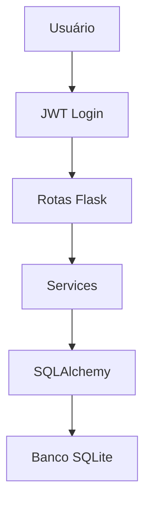

# Fluxograma de fluxo de autenticação e manutenção de dados

```mermaid
flowchart TD
    A[Usuário] --> B[JWT Login]
    B --> C[Rotas Flask]
    C --> D[Services]
    D --> E[SQLAlchemy]
    E --> F[Banco SQLite]
```
